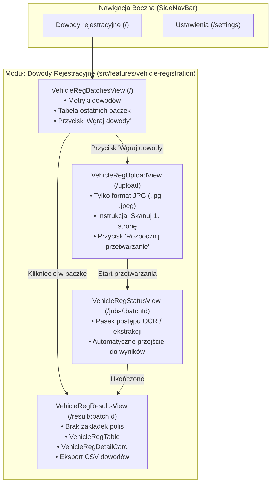

# Plan Implementacyjny: Refaktoring Frontendu dla Czytnika Dowodów Rejestracyjnych

Niniejszy dokument przedstawia szczegółowy plan refaktoringu warstwy frontendowej (`policyReader-web`). Głównym celem jest przekształcenie dotychczasowego generycznego/polisowego interfejsu w dedykowany, modułowy system skupiony wyłącznie na odczytywaniu **dowodów rejestracyjnych pojazdów**, z zachowaniem czystej architektury pakietowej pod przyszłe moduły (np. analizator polis).

---

## 1. Opis Celu i Architektury (Goal Description)

### Główne Założenia:
1. **Domenowe nazewnictwo i organizacja pakietów (Feature-based Architecture):**
   * Likwidacja ogólnych nazw (`DashboardView`, `BatchResultsView`, itp.) na rzecz nazw domenowych (`VehicleRegBatchesView`, `VehicleRegResultsView`, itp.).
   * Pogrupowanie komponentów w logiczne pakiety domenowe (`src/features/vehicle-registration/`, `src/features/settings/`) oraz pakiet komponentów wspólnych (`src/components/common/`, `src/components/layout/`).
2. **Uproszczenie bocznego menu nawigacji (`SideNavBar`):**
   * Zmiana pierwszej pozycji z `Dashboard` na **`Dowody rejestracyjne`** (ikona `directions_car`, ścieżka `/`).
   * **Usunięcie zakładki `Upload`** z paska bocznego (wejście do uploadu wyłącznie przez dedykowany przycisk akcji na ekranie głównym).
   * Zakładka `Ustawienia` (`/settings`) pozostaje w menu.
3. **Ekran główny dowodów rejestracyjnych (`VehicleRegBatchesView` pod `/`):**
   * Prezentacja metryk dostosowanych do dowodów rejestracyjnych (*Przetworzone dowody*, *Skuteczność odczytu*, *Aktywne paczki*).
   * Przycisk akcji **„Wgraj dowody”** / **„Nowa paczka”** prowadzący do widoku `/upload`.
   * Tabela historii paczek z bezpośrednim przejściem do postępu (`/jobs/:batchId`) lub wyników (`/result/:batchId`).
4. **Ekran wgrywania (`VehicleRegUploadView` pod `/upload`):**
   * Restrykcja formatu: akceptowane **wyłącznie pliki JPG** (`.jpg`, `.jpeg`, MIME `image/jpeg`). Całkowita blokada PDF i PNG z czytelnym komunikatem błędu.
   * Widoczna instrukcja dla użytkownika: informacja o **fotografowaniu/skanowaniu wyłącznie pierwszej strony dowodu rejestracyjnego** (gdzie znajdują się wszystkie kluczowe dane).
   * Obsługa wgrywania pojedynczych lub wielu zdjęć w paczce.
5. **Ekran wyników (`VehicleRegResultsView` pod `/result/:batchId`):**
   * **Usunięcie zakładek (Tabs)** oraz całkowite wycięcie kodu powiązanego z polisami ubezpieczeniowymi.
   * Dedykowana tabela rozpoznanych dowodów rejestracyjnych (`VehicleRegTable`): numer rejestracyjny, marka i model, rodzaj pojazdu, VIN, rok produkcji, status odczytu.
   * Wyszukiwarka i filtry (marka, rodzaj pojazdu, status).
   * Podgląd szczegółów dowodu z kopiowaniem rubryk do schowka (`VehicleRegDetailCard` i `VehicleRegDetailModal`).
   * Eksport CSV dostosowany do pól dowodu rejestracyjnego.



---

## 2. Wymagany Przegląd Użytkownika (User Review Required)

> [!IMPORTANT]
> **1. Ścieżki URL w routingu:**
> Główne ścieżki pozostają wstecznie zgodne z obecną architekturą (`/`, `/upload`, `/jobs/:batchId`, `/result/:batchId`, `/settings`), ale komponenty realizujące te widoki zyskują precyzyjne nazwy domenowe w `src/features/vehicle-registration/`.
>
> **2. Całkowite usunięcie komponentów polisowych z widoku wyników:**
> Zgodnie z wytycznymi, komponent `PolicyResultsTab.tsx` oraz logika zakładek polisowych w widoku wyników zostaną całkowicie skasowane (nie tylko ukryte). W przyszłości polisy powstaną w odrębnym module `src/features/policies/`.

---

## 3. Proponowana Struktura Pakietów (Target Directory Structure)

```text
src/
├── components/
│   ├── common/                               # Wspólne reużywalne komponenty UI
│   │   ├── MetricCard.tsx
│   │   ├── ProgressBar.tsx
│   │   ├── StatusBadge.tsx
│   │   ├── Toast.tsx
│   │   └── ErrorBoundary.tsx
│   ├── layout/                               # Elementy szkieletu aplikacji
│   │   ├── AppLayout.tsx
│   │   └── SideNavBar.tsx
│   └── index.ts                              # Re-eksporty komponentów layoutu i common
│
├── features/
│   ├── vehicle-registration/                 # Pakiet: Dowody Rejestracyjne
│   │   ├── pages/
│   │   │   ├── VehicleRegBatchesView.tsx     # Dawny DashboardView
│   │   │   ├── VehicleRegUploadView.tsx      # Dawny UploadView (JPG only)
│   │   │   ├── VehicleRegStatusView.tsx      # Dawny BatchStatusView
│   │   │   └── VehicleRegResultsView.tsx     # Dawny BatchResultsView
│   │   ├── components/
│   │   │   ├── VehicleRegTable.tsx           # Dawny VehicleRegResultsTab
│   │   │   ├── VehicleRegDetailCard.tsx      # Karta szczegółów i kopiowania pól
│   │   │   └── VehicleRegDetailModal.tsx     # Dawny DetailModal (dla dowodów)
│   │   └── index.ts                          # Re-eksporty modułu
│   │
│   └── settings/                             # Pakiet: Ustawienia
│       ├── pages/
│       │   └── SettingsView.tsx              # Widok ustawień (domyślnie dowody)
│       ├── components/
│       │   └── VehicleCopyFieldsConfig.tsx   # Konfiguracja pól schowka dowodów
│       └── index.ts                          # Re-eksporty modułu
│
├── config/
│   ├── appConfig.ts                          # Ograniczenie allowedExtensions do JPG
│   └── vehicleFields.ts                      # Konfiguracja pól urzędowych PWPW
├── hooks/
│   ├── useAppSettings.ts
│   └── useVehicleCopySettings.ts
├── services/
│   └── api.ts
├── types/
│   └── api.ts
└── main.tsx                                  # Konfiguracja routingu aplikacji
```

---

## 4. Szczegółowy Plan Zmian w Kodzie (Proposed Changes)

### Krok 1: Organizacja pakietów bazowych (`src/components/common/` oraz `src/components/layout/`)
* **[NEW] `src/components/layout/AppLayout.tsx`**: Przeniesienie i aktualizacja importów z `AppLayout.tsx`.
* **[NEW] `src/components/layout/SideNavBar.tsx`**:
  * Aktualizacja listy zakładek w `SideNavBar`:
    ```ts
    const DEFAULT_NAV_ITEMS: NavItem[] = [
      {
        label: 'Dowody rejestracyjne',
        to: '/',
        icon: 'directions_car',
        end: true,
      },
      {
        label: 'Ustawienia',
        to: '/settings',
        icon: 'settings',
      },
    ];
    ```
  * Całkowite usunięcie elementu `Upload` z listy `DEFAULT_NAV_ITEMS`.
* **[NEW] `src/components/common/MetricCard.tsx`, `ProgressBar.tsx`, `StatusBadge.tsx`, `Toast.tsx`, `ErrorBoundary.tsx`**:
  Przeniesienie komponentów pomocniczych do katalogu `src/components/common/`.
* **[MODIFY] `src/components/index.ts`**:
  Re-eksportowanie komponentów z nowych ścieżek `common/` i `layout/` w celu zachowania spójności.

---

### Krok 2: Konfiguracja i restrykcje plików JPG (`src/config/appConfig.ts`)
* **[MODIFY] `src/config/appConfig.ts`**:
  * Zmiana `allowedExtensions`:
    ```ts
    export const APP_CONFIG: AppConfig = {
      maxFilesPerBatch: 200,
      maxFileSizeBytes: 25 * 1024 * 1024,
      defaultPageSize: 10,
      // Dozwolone wyłącznie obrazy JPG dowodów rejestracyjnych
      allowedExtensions: ['.jpg', '.jpeg'],
    };
    ```

---

### Krok 3: Pakiet Dowodów Rejestracyjnych – Strona Główna (`VehicleRegBatchesView.tsx`)
* **[NEW] `src/features/vehicle-registration/pages/VehicleRegBatchesView.tsx`**:
  * Zastępuje dawny `DashboardView.tsx`.
  * Nagłówek: **Dowody rejestracyjne** | *Zarządzanie paczkami odczytanych dowodów rejestracyjnych pojazdów.*
  * Przycisk akcji w nagłówku:
    ```tsx
    <Link
      to="/upload"
      className="px-md py-sm rounded-lg font-label-bold text-label-bold bg-secondary text-on-secondary hover:bg-secondary/90 transition-colors flex items-center gap-xs shadow-sm"
    >
      <span className="material-symbols-outlined text-[18px]">add_photo_alternate</span>
      <span>Wgraj dowody</span>
    </Link>
    ```
  * Etykiety metryk:
    * *Przetworzone dowody (30 dni)*
    * *Skuteczność odczytu*
    * *Aktywne paczki*
  * Tabela paczek: etykiety po polsku, obsługa pustego stanu informująca o możliwości wgrania zdjęć dowodów rejestracyjnych.

---

### Krok 4: Pakiet Dowodów Rejestracyjnych – Ekran Wgrywania JPG (`VehicleRegUploadView.tsx`)
* **[NEW] `src/features/vehicle-registration/pages/VehicleRegUploadView.tsx`**:
  * Zastępuje dawny `UploadView.tsx`.
  * Nagłówek: **Wgrywanie dowodów rejestracyjnych** | *Dodaj zdjęcia dowodów rejestracyjnych (JPG) do automatycznego odczytu danych pojazdu.*
  * **Wskazówka dla użytkownika (Notice Banner):**
    ```tsx
    <div className="bg-secondary/10 border border-secondary/30 rounded-xl p-md flex items-start gap-md">
      <span className="material-symbols-outlined text-secondary text-[24px] mt-0.5">info</span>
      <div>
        <p className="font-label-bold text-label-bold text-secondary">
          Wskazówka: Zeskanuj lub sfotografuj wyłącznie pierwszą stronę dowodu
        </p>
        <p className="text-body-sm text-on-surface-variant mt-0.5">
          Wszystkie kluczowe dane pojazdu (nr rejestracyjny, VIN, marka, model, rok produkcji, dopuszczalne masy) znajdują się na pierwszej stronie dokumentu.
        </p>
      </div>
    </div>
    ```
  * Restrykcja `input type="file"`:
    `accept=".jpg,.jpeg,image/jpeg"`
  * Walidacja rozszerzeń: odrzucanie plików innych niż `.jpg` i `.jpeg` z komunikatem:
    *`Plik "[nazwa]" został pominięty — akceptowane są wyłącznie zdjęcia JPG/JPEG dowodów rejestracyjnych.`*
  * Przycisk startu: **Rozpocznij odczyt ([liczba_plików])**.

---

### Krok 5: Pakiet Dowodów Rejestracyjnych – Ekran Postępu (`VehicleRegStatusView.tsx`)
* **[NEW] `src/features/vehicle-registration/pages/VehicleRegStatusView.tsx`**:
  * Zastępuje dawny `BatchStatusView.tsx`.
  * Etykiety dostosowane do dowodów rejestracyjnych (*Trwa odczytywanie danych z dowodów rejestracyjnych...*).
  * Przekierowanie po zakończeniu do `/result/:batchId`.

---

### Krok 6: Pakiet Dowodów Rejestracyjnych – Ekran Wyników i Komponenty (`VehicleRegResultsView.tsx`)
* **[NEW] `src/features/vehicle-registration/components/VehicleRegTable.tsx`**:
  * Wyewoluowany z `VehicleRegResultsTab.tsx`. Staje się bezpośrednią tabelą wyników bez zależności od systemu zakładek.
* **[NEW] `src/features/vehicle-registration/components/VehicleRegDetailCard.tsx`**:
  * Przeniesienie z `components/results/VehicleRegDetailCard.tsx`.
* **[NEW] `src/features/vehicle-registration/components/VehicleRegDetailModal.tsx`**:
  * Dedykowany modal podglądu wybranego dowodu rejestracyjnego z możliwością kopiowania poszczególnych pól lub całego wiersza.
* **[NEW] `src/features/vehicle-registration/pages/VehicleRegResultsView.tsx`**:
  * Zastępuje dawny `BatchResultsView.tsx`.
  * **Całkowite usunięcie kodu zakładek i tabeli polis.**
  * Bezpośrednie wyświetlanie tabeli `VehicleRegTable` oraz podglądu szczegółów `VehicleRegDetailCard`.
  * Wyszukiwanie (nr rej, VIN, marka) oraz filtrowanie po marce i rodzaju pojazdu.
  * Przycisk eksportu CSV (`apiService.getBatchCsvExportUrl(batchId, 'vehicle_registration')`).

---

### Krok 7: Pakiet Ustawień (`src/features/settings/`)
* **[NEW] `src/features/settings/pages/SettingsView.tsx`**:
  * Przeniesienie z `src/pages/SettingsView.tsx`.
  * Domyślna aktywna zakładka ustawiona na `vehicles` (Dowody rejestracyjne).
* **[NEW] `src/features/settings/components/VehicleCopyFieldsConfig.tsx`**:
  * Przeniesienie z `src/components/settings/VehicleCopyFieldsConfig.tsx`.

---

### Krok 8: Aktualizacja Routingu (`src/main.tsx`) oraz Usunięcie Zbędnych Plików
* **[MODIFY] `src/main.tsx`**:
  ```tsx
  import { VehicleRegBatchesView } from "./features/vehicle-registration/pages/VehicleRegBatchesView";
  import { VehicleRegUploadView } from "./features/vehicle-registration/pages/VehicleRegUploadView";
  import { VehicleRegStatusView } from "./features/vehicle-registration/pages/VehicleRegStatusView";
  import { VehicleRegResultsView } from "./features/vehicle-registration/pages/VehicleRegResultsView";
  import { SettingsView } from "./features/settings/pages/SettingsView";
  ```
  Routing:
  * `/` ➔ `VehicleRegBatchesView`
  * `/upload` ➔ `VehicleRegUploadView`
  * `/jobs/:batchId` ➔ `VehicleRegStatusView`
  * `/result/:batchId` ➔ `VehicleRegResultsView`
  * `/settings` ➔ `SettingsView`
* **[DELETE] Usunięcie starych plików zastąpionych nowymi:**
  * `src/pages/DashboardView.tsx`
  * `src/pages/UploadView.tsx`
  * `src/pages/BatchStatusView.tsx`
  * `src/pages/BatchResultsView.tsx`
  * `src/pages/SettingsView.tsx`
  * `src/components/results/PolicyResultsTab.tsx`
  * `src/components/results/VehicleRegResultsTab.tsx`
  * `src/components/results/VehicleRegDetailCard.tsx`
  * `src/components/results/DetailModal.tsx`
  * `src/components/settings/VehicleCopyFieldsConfig.tsx`

---

## 5. Plan Weryfikacji (Verification Plan)

### Automatyczna Weryfikacja:
1. **Kompilacja TypeScript:**
   ```powershell
   npm run build
   ```
   Weryfikacja braku błędów typowania (`tsc -b`), prawidłowości importów i braku wiszących referencji po starych komponentach.
2. **Linter / Sprawdzenie składni:**
   ```powershell
   npm run lint # lub npx tsc --noEmit
   ```

### Weryfikacja Manualna w Przeglądarce:
1. **Boczny pasek nawigacji:**
   * Potwierdzenie obecności tylko dwóch zakładek: *Dowody rejestracyjne* oraz *Ustawienia*.
   * Potwierdzenie braku zakładki *Upload*.
2. **Ekran Główny (`/`):**
   * Sprawdzenie wyświetlania kafelków metryk dowodów oraz tabeli paczek.
   * Kliknięcie przycisku „Wgraj dowody” ➔ poprawne przejście do `/upload`.
3. **Ekran Wgrywania (`/upload`):**
   * Sprawdzenie widoczności banera z instrukcją o skanowaniu pierwszej strony.
   * Próba przeciągnięcia pliku PDF/PNG ➔ zablokowanie z komunikatem o dopuszczeniu wyłącznie JPG.
   * Wybór plików JPG ➔ poprawne dodanie do listy, limit 200 plików.
   * Kliknięcie „Rozpocznij odczyt” ➔ przejście do widoku przetwarzania.
4. **Ekran Wyników (`/result/:batchId`):**
   * Potwierdzenie braku jakichkolwiek zakładek polisowych.
   * Poprawne renderowanie tabeli dowodów rejestracyjnych, filtrowanie, wyszukiwanie, modal szczegółów i kopiowanie pól.
   * Pobranie eksportu CSV z danymi pojazdów.
